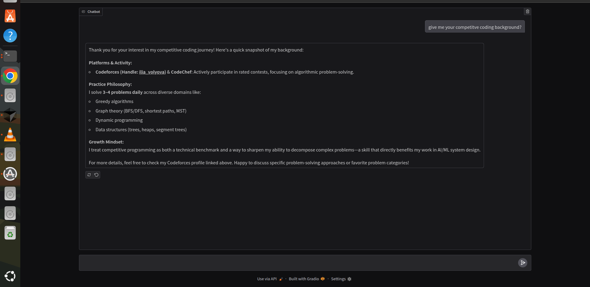
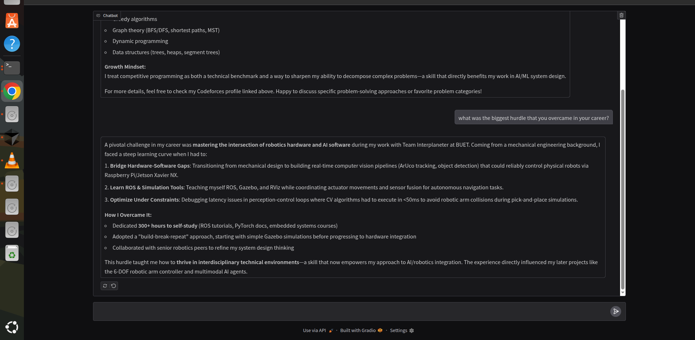
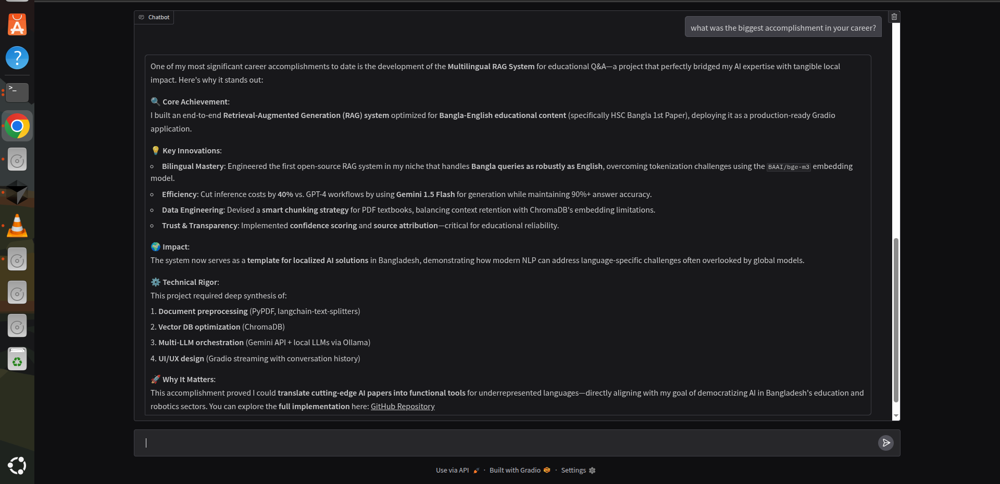
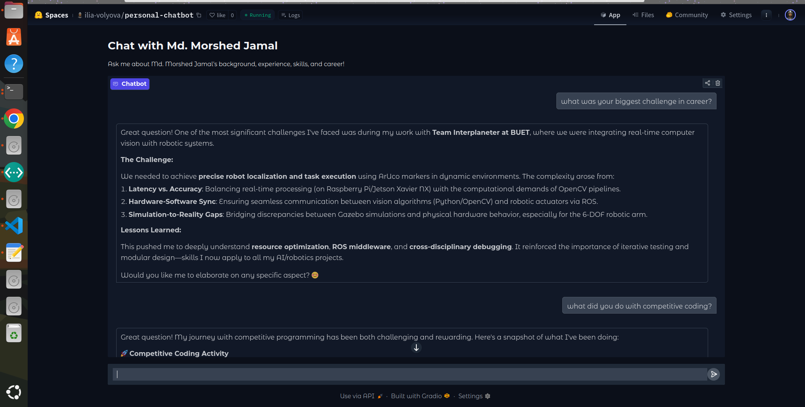
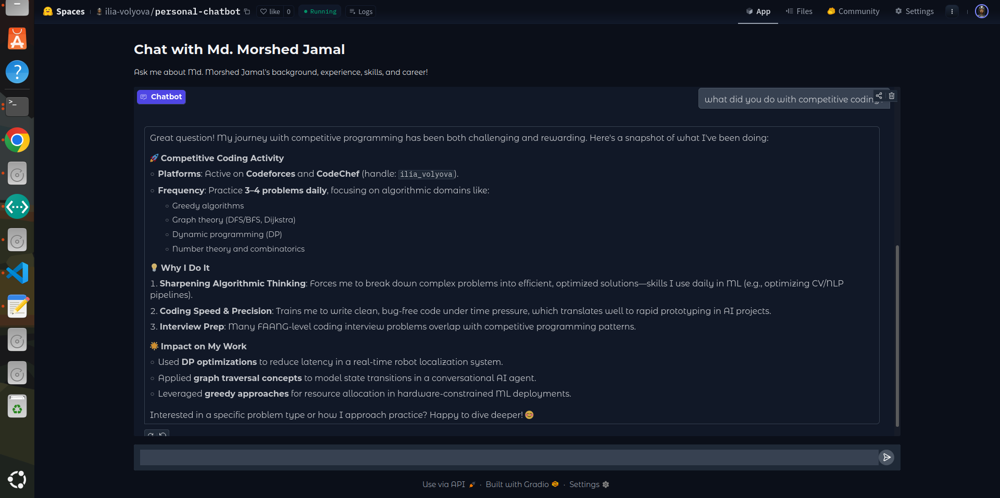
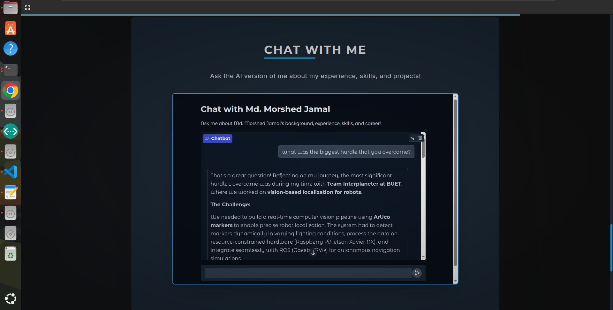
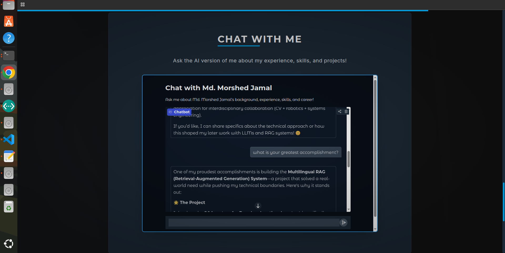
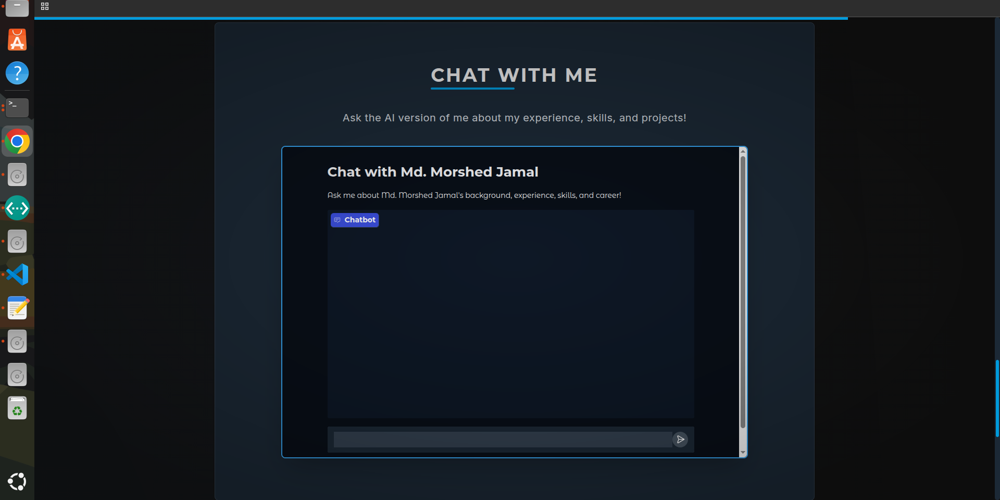

# Personal Website Chatbot 🤖

An intelligent chatbot that represents you on your personal website, powered by AI and built with quality control mechanisms. The bot can answer questions about your background, experience, skills, and career using your LinkedIn profile and personal summary.

## ✨ Features

- **AI-Powered Conversations**: Uses state-of-the-art language models to provide engaging responses
- **Quality Control**: Built-in evaluation system ensures professional and accurate responses
- **Multi-Model Architecture**: Combines different AI models for optimal performance
- **PDF Processing**: Automatically extracts and uses information from your LinkedIn PDF
- **Web Interface**: Clean, user-friendly Gradio interface for easy deployment
- **Error Handling**: Robust error handling and graceful degradation
- **Logging**: Comprehensive logging for monitoring and debugging

## 🌐 Live Demonstrations

### 🚀 Try It Now!

| Platform                   | URL                                                                             | Status    |
| -------------------------- | ------------------------------------------------------------------------------- | --------- |
| **🤗 Hugging Face Spaces** | [personal-chatbot](https://huggingface.co/spaces/ilia-volyova/personal-chatbot) | 🟢 Active |
| **🌍 Personal Portfolio**  | [portfolio](https://1morshed1.github.io/portfolio/)                             | 🟢 Active |

_Click the links above to interact with the live chatbot!_

---

## 🏗️ Architecture

```
┌─────────────────┐    ┌──────────────────┐    ┌─────────────────┐
│   User Input    │───▶│  Main Chatbot    │───▶│   AI Response   │
└─────────────────┘    └──────────────────┘    └─────────────────┘
                                │                        │
                                ▼                        ▼
                       ┌──────────────────┐    ┌─────────────────┐
                       │   Profile Data   │    │   Evaluator     │
                       │ (PDF + Summary)  │    │   (Quality QC)  │
                       └──────────────────┘    └─────────────────┘
                                                         │
                                                         ▼
                                               ┌─────────────────┐
                                               │  Regeneration   │
                                               │  (if needed)    │
                                               └─────────────────┘
```

## 🚀 Quick Start

### Prerequisites

- Python 3.8+
- OpenAI API key (OpenRouter)
- Google API key (for Gemini)

### Installation

1. **Clone the repository**

   ```bash
   git clone https://github.com/1morshed1/personal-website-chatbot.git
   cd personal-website-chatbot
   ```

2. **Install dependencies**

   ```bash
   pip install -r requirements.txt
   ```

3. **Set up your profile data**

   ```bash
   mkdir me
   # Add your LinkedIn PDF as me/linkedin.pdf
   # Add your summary as me/summary.txt
   ```

4. **Configure environment variables**

   ```bash
   cp .env.example .env
   # Edit .env with your API keys
   ```

5. **Run the application**
   ```bash
   python main.py
   ```

## 📁 Project Structure

```
personal-website-chatbot/
├── main.py                 # Main application file
├── requirements.txt        # Python dependencies
├── .env.example           # Environment variables template
├── .gitignore            # Git ignore rules
├── me/                   # Your personal data
│   ├── linkedin.pdf      # Your LinkedIn profile PDF
│   └── summary.txt       # Your personal summary
└── README.md            # This file
```

## ⚙️ Configuration

### Environment Variables

Create a `.env` file in the root directory:

```env
OPENAI_API_KEY=your_openrouter_api_key_here
GOOGLE_API_KEY=your_google_api_key_here
```

### Personal Data Setup

1. **LinkedIn PDF** (`me/linkedin.pdf`):

   - Export your LinkedIn profile as PDF
   - Place it in the `me/` directory

2. **Personal Summary** (`me/summary.txt`):
   - Write a comprehensive summary of your background
   - Include key skills, experiences, and achievements
   - Use plain text format

### Model Configuration

You can customize the AI models used by modifying the `PersonalChatbot` class:

- **Primary Model**: `tngtech/deepseek-r1t2-chimera:free` (via OpenRouter)
- **Evaluation Model**: `gemini-2.5-flash` (via Google AI)
- **Regeneration Model**: `tngtech/deepseek-r1t2-chimera:free` (via OpenRouter)

## 🔧 API Setup

### OpenRouter API

1. Sign up at [OpenRouter](https://openrouter.ai/)
2. Get your API key from the dashboard

### Google AI API

1. Visit [Google AI Studio](https://aistudio.google.com/)
2. Create a new project and enable the Gemini API
3. Generate an API key

## 🎨 Customization

### Changing the Persona

Edit the `name` parameter in the `PersonalChatbot` class:

```python
chatbot = PersonalChatbot(name="Your Name Here")
```

### Modifying Prompts

The system prompts can be customized in the `_create_prompts` method to change the chatbot's personality and behavior.

### Adding Special Behaviors

The code includes an example of special behavior for patent-related questions (pig latin responses). You can add similar custom behaviors in the `chat` method.

## 🧪 Testing

Run basic tests to ensure everything is working:

```bash
# Test the chatbot with a simple question
python -c "
from main import PersonalChatbot
bot = PersonalChatbot()
print(bot.chat('Tell me about your experience', []))
"
```

## 📊 Monitoring

The application includes comprehensive logging. Monitor the logs for:

- API call success/failure
- Evaluation results
- Error conditions
- Performance metrics

## 🚀 Deployment

### Local Development

```bash
python main.py
```

### Docker Deployment

```dockerfile
FROM python:3.9-slim

WORKDIR /app
COPY requirements.txt .
RUN pip install -r requirements.txt

COPY . .
EXPOSE 7860

CMD ["python", "main.py"]
```

### Demo










## 🔍 Troubleshooting

### Common Issues

1. **API Key Errors**

   - Verify your API keys in the `.env` file
   - Check API key permissions and credits

2. **File Not Found**

   - Ensure `me/linkedin.pdf` and `me/summary.txt` exist
   - Check file permissions

3. **Model Errors**

   - Verify model names are correct
   - Check if models are available in your region

4. **Port Already in Use**
   - Change the port in the `launch()` method
   - Kill existing processes using the port

### Debug Mode

Enable detailed logging by modifying the logging level:

```python
logging.basicConfig(level=logging.DEBUG)
```

## 🤝 Contributing

1. Fork the repository
2. Create a feature branch (`git checkout -b feature/amazing-feature`)
3. Commit your changes (`git commit -m 'Add amazing feature'`)
4. Push to the branch (`git push origin feature/amazing-feature`)
5. Open a Pull Request

## 📜 License

This project is licensed under the MIT License - see the [LICENSE](LICENSE) file for details.

## 🙏 Acknowledgments

- [Gradio](https://gradio.app/) for the web interface
- [OpenRouter](https://openrouter.ai/) for AI model access
- [Google AI](https://ai.google.dev/) for evaluation capabilities
- [PyPDF](https://pypdf.readthedocs.io/) for PDF processing

## 📞 Support

If you encounter any issues or have questions:

1. Check the [troubleshooting section](#🔍-troubleshooting)
2. Open an issue on GitHub
3. Review the logs for error details

---

**Made with ❤️ for creating engaging personal website experiences**
